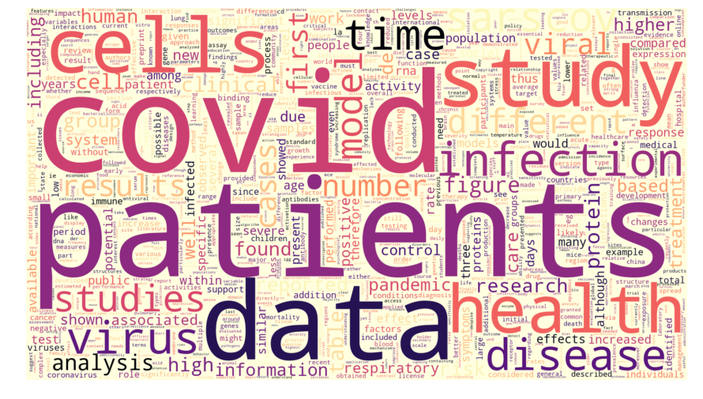

# Meta Analysis of COVID papers
***

This project is a test of distributed network computing by performing word processing tasks on a dataset of COVID-19 related papers. This was done for the exam of the UNIPD course Management and analysis of physical datasets.

This task was accomplished throught a cluster of 3 machines all part of the university's Cloud Veneto network and using the [Dask](https://dask.org/) framework

The COVID_papers & json1line directories contain a subset of around 1000 papers chosen from the dataset at https://www.kaggle.com/allen-institute-for-ai/CORD-19-research-challenge

Contrbutors to this project:

[Luca Negri](https://github.com/Luca-Negri)
[Federica Benassi](https://github.com/fedebenassi) 
Luca Rinaldi
[Rebecca Ghidoni](https://github.com/GhidoniR)
